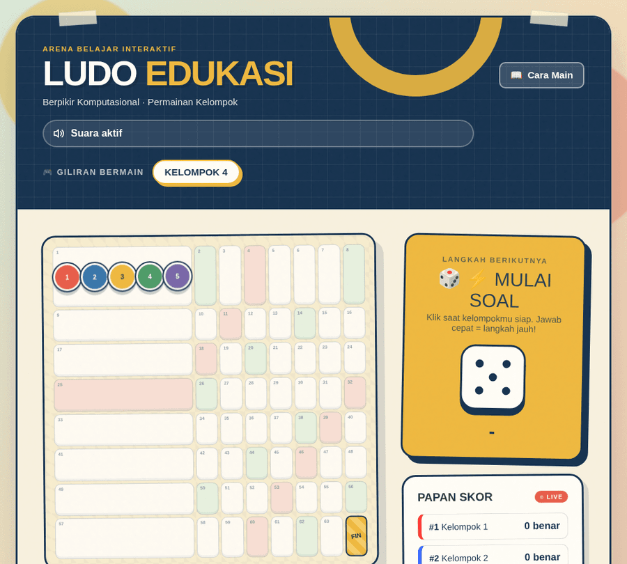
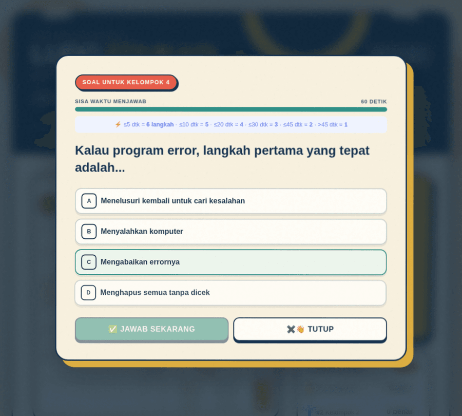
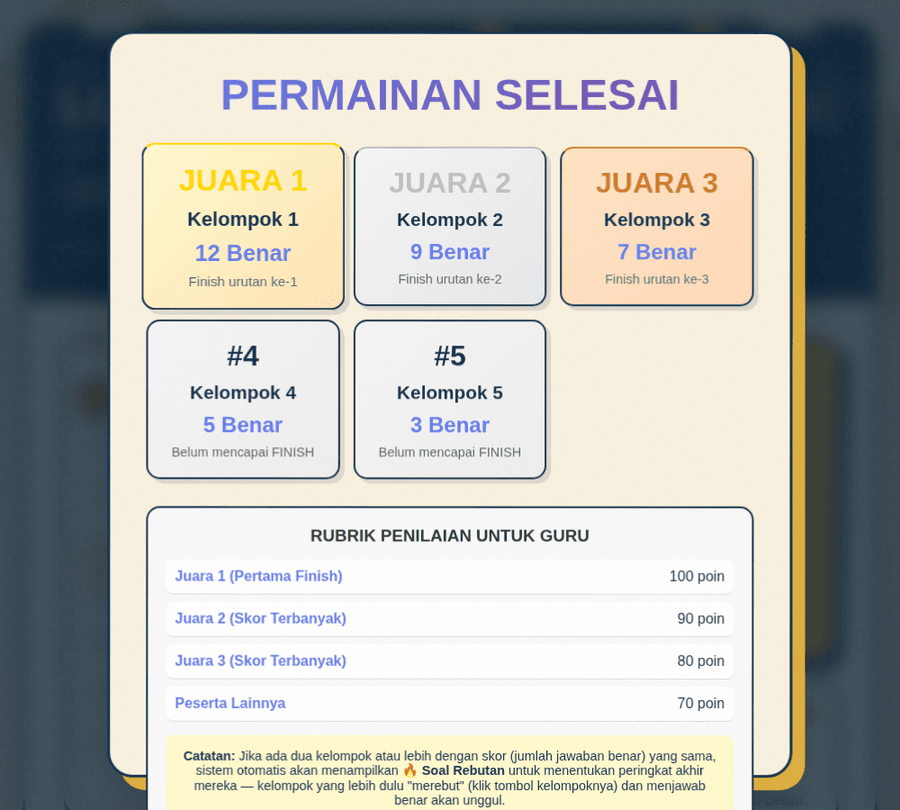

# 🎲 Ludo Edukasi

Ludo Edukasi adalah permainan kuis kelompok bertema **berpikir komputasional** (dekomposisi, abstraksi, pengenalan pola, dan algoritma), dikemas dalam papan ala Ludo. Setiap kelompok bergiliran menjawab soal — makin cepat dan tepat menjawab, makin jauh pion melangkah menuju FINISH.

Cocok dipakai guru/fasilitator sebagai media belajar interaktif di kelas.

## ✨ Fitur

- **5 kelompok**, masing-masing punya bank soal sendiri (16 soal per kelompok, seputar konsep berpikir komputasional).
- **Kecepatan menjawab menentukan langkah pion** — bukan dadu acak. Jawab dalam ≤5 detik = 6 langkah, makin lama makin sedikit.
- **Papan skor otomatis terurut** berdasarkan jumlah jawaban benar.
- **🔥 Soal Rebutan otomatis** saat ada dua kelompok atau lebih dengan skor sama di akhir permainan — kelompok yang lebih dulu klik tombol "REBUT!" dan menjawab benar akan unggul peringkatnya.
- **Permainan selesai otomatis** begitu 3 kelompok pertama mencapai kotak FINISH — kelompok lain tidak perlu menyelesaikan papan.
- Efek suara untuk jawaban benar/salah (bisa dimatikan lewat tombol suara).
- Modal "Cara Bermain" bawaan, jadi fasilitator tidak perlu menjelaskan aturan dari nol.
- Sepenuhnya dependency-free — HTML, CSS, dan JavaScript murni tanpa framework atau build step.

## 📸 Cuplikan Layar

| Papan Permainan | Modal Soal | Papan Skor Akhir |
|---|---|---|
|  |  |  |

## 🚀 Menjalankan secara lokal

Karena tidak ada build step, cara paling sederhana adalah membuka `index.html` langsung di browser.

Kalau ingin menjalankan lewat Netlify Dev (agar konfigurasi header di `netlify.toml` ikut teruji):

```bash
netlify dev --port 8889
```

Lalu buka `http://localhost:8889`.

## 🗂️ Struktur proyek

```
├── index.html              # markup, bank soal, dan logika permainan
├── assets/
│   ├── css/game.css         # seluruh tema visual, layout, dan animasi
│   ├── audio/                # efek suara jawaban benar/salah
│   └── screenshots/          # gambar untuk README
├── netlify.toml             # konfigurasi publikasi & cache aset audio
└── agents.md                 # panduan konvensi proyek untuk AI coding agent
```

## 🛠️ Teknologi

- HTML5 untuk struktur permainan dan bank soal
- CSS3 untuk tata letak responsif, animasi, dan gaya papan permainan
- JavaScript tanpa framework untuk logika dadu, skor, timer, audio, dan pergerakan pion
- Netlify untuk hosting statis dan pengaturan cache aset audio

## 🤝 Kontribusi

Pull request dan issue sangat terbuka — baik untuk menambah bank soal, memperbaiki bug, maupun ide fitur baru. Lihat `agents.md` untuk konvensi kode yang dipakai di proyek ini.

## 📄 Lisensi

Proyek ini dirilis di bawah [Lisensi MIT](LICENSE) — bebas dipakai, dimodifikasi, dan disebarluaskan untuk kebutuhan belajar-mengajar.
